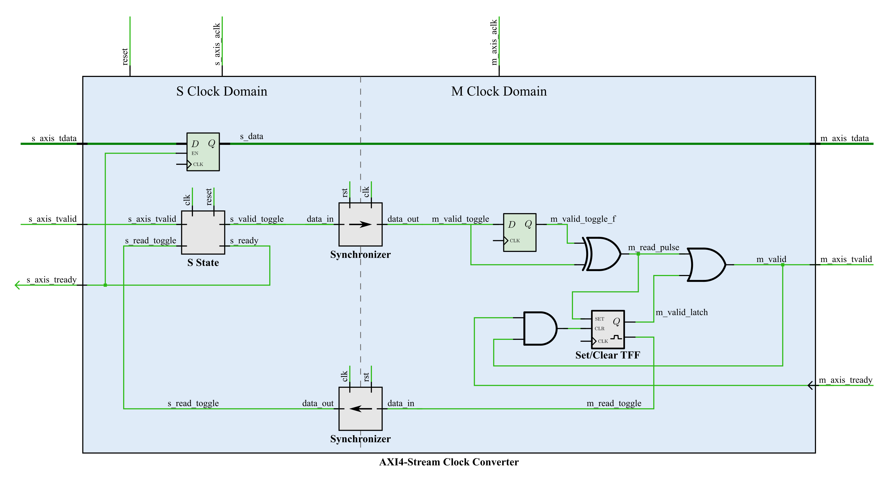

# AXI4-Stream Clock Converter
Designed by Aaron Young

This repository contains a custom AXI4-Stream clock converter design I created using VHDL for my PhD dissertation to convert an [AXI4-Stream](https://static.docs.arm.com/ihi0051/a/IHI0051A_amba4_axi4_stream_v1_0_protocol_spec.pdf) from one clock domain to another clock domain using a bi-directional toggle synchronizer design. A detailed description of the design can be found in my dissertaion available at **URL HERE** in Section 7.3.2 starting on page 146. This clock convert is designed to have minimal latency and was shown to have less latency than the AXI4-Stream components included with Vivado.


## Usage
The AXI4-Stream clock converter converts an AXI4-Stream from one clock domain to another clock domain. The clock converter can work with any width of data and the `DATA_WIDTH` generic is use to specify the width of the tdata bus.

Component Declaration:
```vhdl
COMPONENT axis_clock_converter
    GENERIC (
        DATA_WIDTH    : positive := 512
    );
    PORT (
        areset_n      : IN  STD_LOGIC;

        s_axis_aclk   : IN  STD_LOGIC;
        s_axis_tvalid : IN  STD_LOGIC;
        s_axis_tready : OUT STD_LOGIC;
        s_axis_tdata  : IN  STD_LOGIC_VECTOR(DATA_WIDTH-1 DOWNTO 0);

        m_axis_aclk   : IN  STD_LOGIC;
        m_axis_tvalid : OUT STD_LOGIC;
        m_axis_tready : IN  STD_LOGIC;
        m_axis_tdata  : OUT STD_LOGIC_VECTOR(DATA_WIDTH-1 DOWNTO 0)
    );
END COMPONENT;
```

Component Instantiation:
```vhdl
clock_converter : axis_clock_converter
GENERIC MAP (
    DATA_WIDTH    => 512
)
PORT MAP (
    areset_n      => areset_n,

    s_axis_aclk   => s_axis_aclk,
    s_axis_tvalid => s_axis_tvalid,
    s_axis_tready => s_axis_tready,
    s_axis_tdata  => s_axis_tdata,

    m_axis_aclk   => m_axis_aclk,
    m_axis_tvalid => m_axis_tvalid,
    m_axis_tready => m_axis_tready,
    m_axis_tdata  => m_axis_tdata
);
```

## Testbench
A testbench for the AXI4-Steam clock converter can be found in the `testbench` folder. The testbench was originally used with [Xilinx Vivado](https://www.xilinx.com/products/design-tools/vivado.html), but it can also be ran with the open-source [GHDL](http://ghdl.free.fr/) simulator. A generic [Python 3](https://www.python.org/) script is provided in `scripts/` to make running testbenches with GHDL easier. With testbench can be ran with 

```bash
python3 scripts/run_testbenches.py -t testbench/axis_clock_converter_tb.vhd
```
